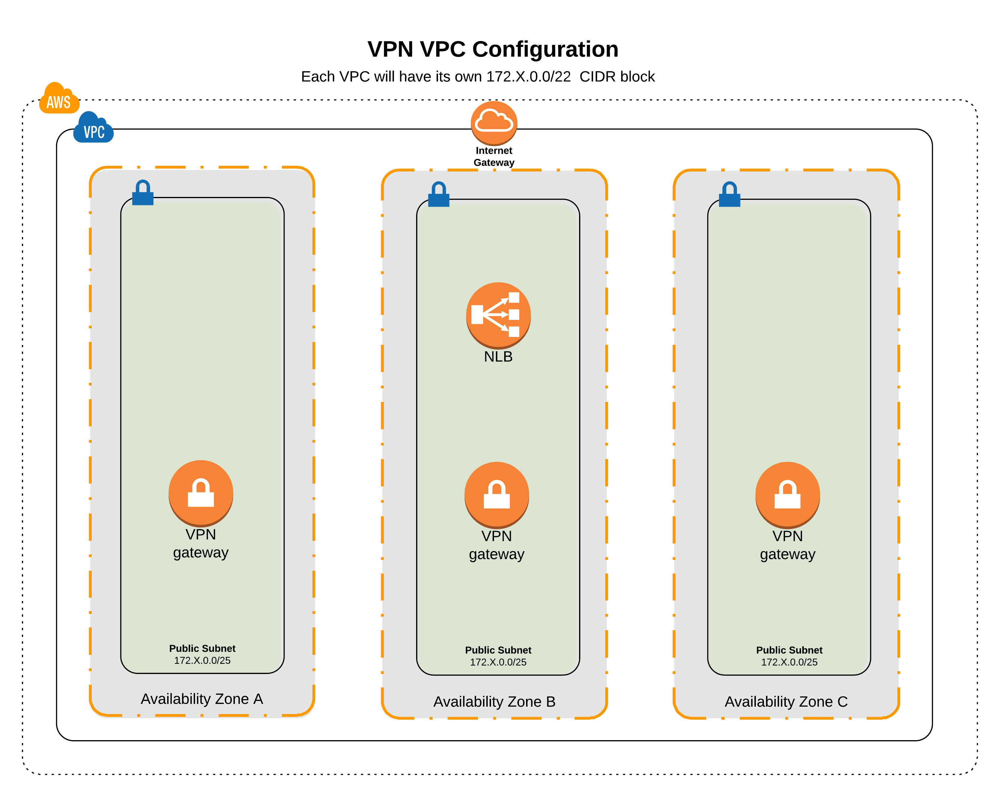

## Kubernetes VPC Design
Each VPN VPC is designed as follows (**starting from 172.28.0.0**) to allow VPC peering without collisions:

| CIDR           | Purpose                                                    | IP Address Total | Notes                                              |
| ---------------| -----------------------------------------------------------| ---------------- | -------------------------------------------------- |
| 172.28.0.0/22  | Each VPC will be assigned a network from this range        | 1024             | Each IP block spans: 172.X.Y.0 - 10.X.Y+3.255      |


We assume that each AWS region has at most 6 availability zones.
Each 172.X.0.0/24 CIDR block is further broken down into the following segments:


| IP Range -  172.X.0.0/22      | Type                          | Purpose                       | IP Addresses Total          | IP Addresses per AZ         | Notes                       |
| ----------------------------- | ----------------------------- | ----------------------------- | --------------------------- | --------------------------- | --------------------------- |
| 172.X.0.0 - 172.X.2.255       | **Public Subnets**            | Load Balanacers, VPN Gateways | 768                         | 128 (each subnet is /25)    | The public subnet space is small on purpose, as very few services will be exposed directly on the public subnet |
| 172.X.3.0/24 - 172.X.3.255    | **Reserved**                  | Reserved                      | 256                         | Varies on usage             | Can be used by any of the above if space runs out |

We realize that there might be some wasted IP addresses in the regions with less availability zones, but that is an inherent limitation with CIDR block addressing for describing subnets in AWS VPC




## Usage

```hcl
provider "aws" {
  version = "1.52.0"
  alias   = "us-west-2"

  allowed_account_ids = ["774331681746"]
  region              = "us-west-2"
}

provider "random" {
  version = "2.0.0"
}

provider "template" {
  version = "1.0.0"
}

module "development_vpc_for_vpn" {
  source = "terraform-aws-name/modules/provider/aws/base/vpc-vpn"

  providers {
    aws      = "aws.us-west-2"
    random   = "random"
    template = "template"
  }

  environment             = "development"
  starting_address        = "172.28.0.0"
}
```

## Terraform version

Terraform version 0.11.14 or newer is required for this module to work.

## Inputs

| Name | Description | Type | Default | Required |
|------|-------------|:----:|:-----:|:-----:|
| environment | The environment the VPC belongs to | string | - | yes |
| starting\_address | The starting address for a /22 CIDR block to assign the VPC. Must not be in CIDR block annotation. | string | - | yes |
| tags | Additional default tags to add all resources | map | `<map>` | no |

## Outputs

| Name | Description |
|------|-------------|
| azs | The availability zones used in the VPC |
| public\_route\_table\_ids | List of IDs of public route tables |
| public\_subnets | List of IDs of the public subnets |
| public\_subnets\_cidr\_blocks | List of cidr_blocks of public subnets |
| reserved\_cidr\_blocks | The remaining IP blocks that were not used for any of the subnets |
| vpc\_cidr\_block | The CIDR block of the VPC |
| vpc\_id | The ID of the VPC |
| vpc\_main\_route\_table\_id | The ID of the main route table associated with this VPC |
| vpc\_name | The name of the VPC |

## Tests

Tests implemeneted with the [TerraTest](https://github.com/gruntwork-io/terratest) framework.

## Authors

Module is maintained by the EngOps team @ OpenGov

## License

Apache 2 Licensed. See LICENSE for full details.
